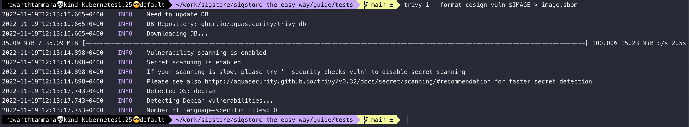
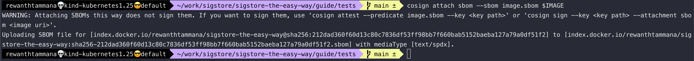
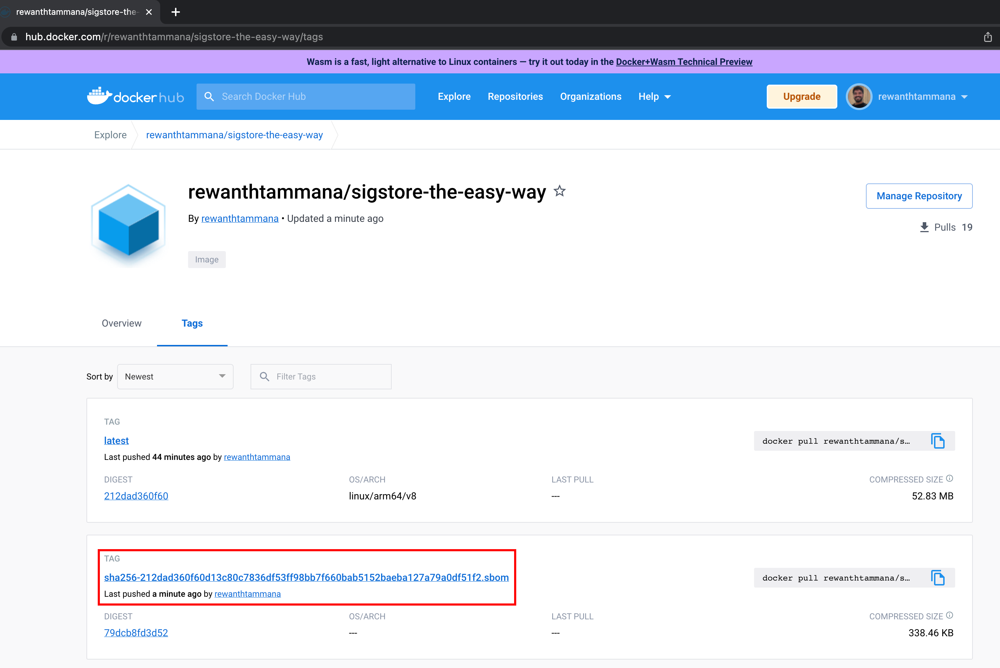

# Attach artifacts

In this example, we will attach [SBOMs](../sbom/readme.md) to images. The workflow is similar for attaching signatures/attestations to an artifact.

## Set image

We can follow the steps from this [section](./sign-and-verify-with-key.md#set-image), to set image. Just make sure you have $IMAGE set appropriately.

```bash
echo $IMAGE
```


## Generate SBOM for the image

[SBOM section](../sbom/generate.md#trivy) decrypts the below command & it's output in great detail. It explains more about SBOMs as well.

```bash
trivy i --format cosign-vuln $IMAGE > image.sbom
```



## Attach SBOM with the image

It's recommended to keep track of all the known vulnerabilities at the time of commiting/pushing an image. We will attach the above generated SBOM with list of dependencies & vulnerabilities to the image & push it to registry.

```bash
cosign attach --sbom image.sbom $IMAGE
```



We can see the sbom artifact uploaded to the registry. In this case, it's dockerhub.



## NOTE

The `attach` feature only uploads the provided artifact to the registry. It doesn't sign the artifact, so anyone can tamper it & there's no way for verification. To sign artifacts like SBOMs, etc, we have to [attest](./attest-and-verify-artifacts.md) the artifact instead of attaching it.

