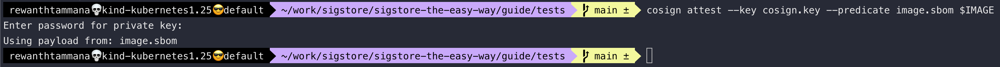
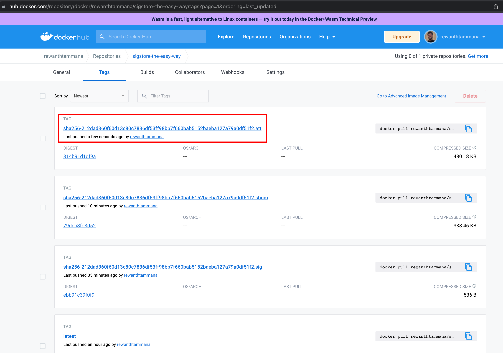
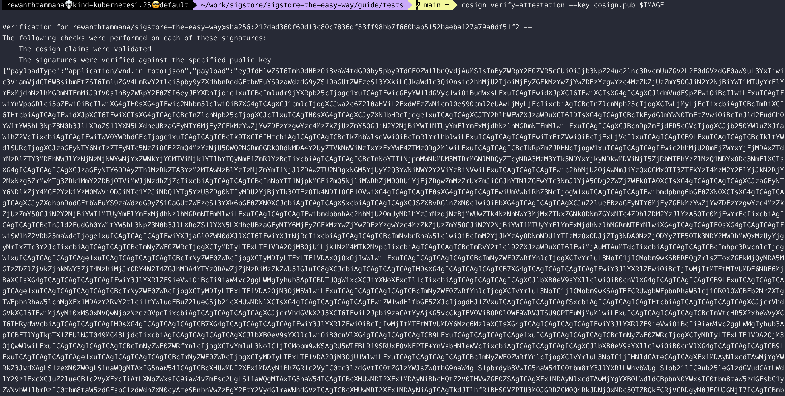
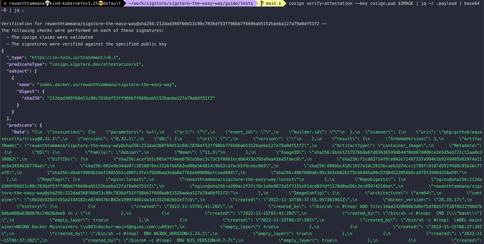

# Attest and verify artifacts

In this example, we will attest [SBOMs](../sbom/readme.md). The workflow is similar for attesting signatures/attestations.

## Set image

We can follow the steps from this [section](./sign-and-verify-with-key.md#set-image), to set image. Just make sure you have $IMAGE set appropriately.

```bash
echo $IMAGE
```


## Generate SBOM for the image

[SBOM section](../sbom/generate.md#trivy) decrypts the below command & it's output in great detail. It explains more about SBOMs as well.

```bash
trivy i --format cosign-vuln $IMAGE > image.sbom
```


## Attest and push the sbom to OCI registry

We will attest the generated `image.sbom` as source of truth, sign it with the private key & push it to the registry.

```bash
cosign attest --key cosign.key --predicate image.sbom $IMAGE
```



We can see the attested artifact uploaded to the registry. In this case, it's dockerhub.



## Verify the sbom of the image from registry

In future, whenever we want to validate the sbom of the image, we can verify it with the below command.

```bash
cosign verify-attestation --key cosign.pub $IMAGE
```



## Extract artifact from the registry

The above command verifies & returns the uploaded artifact data in base64 format. We can decode it to query the artifact (in this case, SBOM file).

```bash
cosign verify-attestation --key cosign.pub $IMAGE | jq -r .payload | base64 -D | jq .
```


