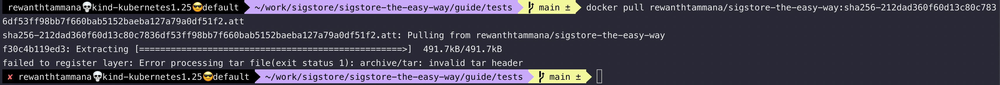
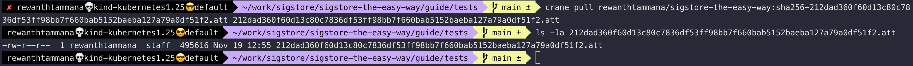
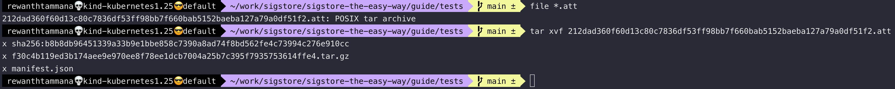
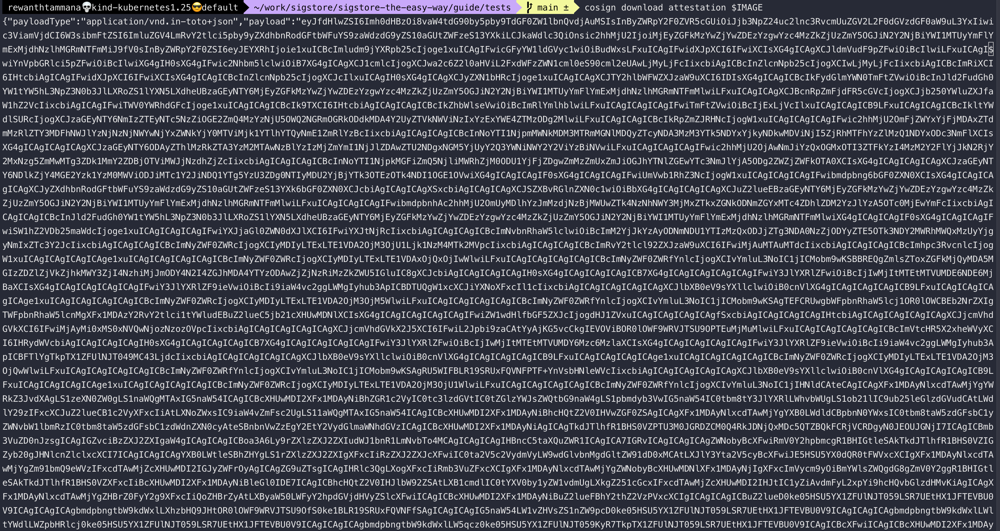

# Download artifacts

Whenever the operations like signing & attesting of artifacts is performed, the signatures or attestations or SBOMs or blobs are uploaded directly to the registry. Docker CLI isn't helpful in this case to pull/read these special artifacts. When we try to pull the artifact with the docker command, it tries to un-tar the compressed file to an image format. There are numerous other ways to read the signatures/attestations/SBOMs/blobs from the registry. We will discuss a few ways in this section.

```bash
docker pull rewanthtammana/sigstore-the-easy-way:sha256-212dad360f60d13c80c7836df53ff98bb7f660bab5152baeba127a79a0df51f2.att
```



## Set image

```bash
echo $IMAGE
```


## Pre-requisite

Since we are trying to download the attested file from the registry, it's important to complete the previous section. We can follow the same/similar steps to download signatures/blobs/sboms/etc.

In the [previous section](./attest-and-verify-artifacts.md#attest-and-push-the-sbom-to-oci-registry), the attested artifact is uploaded to the registry with `.att` extension.


We can copy the artifact id from the UI. For me, it is, `rewanthtammana/sigstore-the-easy-way:sha256-212dad360f60d13c80c7836df53ff98bb7f660bab5152baeba127a79a0df51f2.att`

## Crane

[Crane](https://github.com/google/go-containerregistry/blob/main/cmd/crane/doc/crane.md) can be helpful to download these artifacts from registries.

Instead of `docker pull <image-sha>.sig`, we can use `crane pull <image-sha>.sig <file-location>` to save the signatures, attestations & sboms to local system.

```bash
crane pull rewanthtammana/sigstore-the-easy-way:sha256-212dad360f60d13c80c7836df53ff98bb7f660bab5152baeba127a79a0df51f2.att 212dad360f60d13c80c7836df53ff98bb7f660bab5152baeba127a79a0df51f2.att
```



Let's analyze the file type.

```bash
file *.att
```

It's a POSIX tar archive. Let's extract the file to see the hidden information.



As you can see the attestation file contains, 3 files - *sha256sum*, *manifest.json* & *another tar archive*. The aim of this guide is to keep things simple, so I will stop here but you can feel free to explore further.

## Cosign

We can download the attestation artifact with the below command,

```bash
cosign download attestation $IMAGE
```



Similiar to above, we can download the signature & SBOM of an image from the registry with `cosign download signature $IMAGE` & `cosign download sbom $IMAGE`.

## Cosign vs Crane for downloading artifacts

Crane downloads the complete artifact & upon extraction, we will find *manifest.json*, *sha256 file with architecture, layers, etc information* & *another tar.gz file with appropriate contents*.

Cosign only downloads the attestation file associated with the image. If you are using tags like `latest` for your image & if that image gets over-ridden in future, `cosign download` will not be able download the previous uploaded attestation because the shasum value of the previous image is different from the new image. To be safe from these kind of edge cases, we made sure in the [beginning](./sign-and-verify-with-key.md#set-image) to use sha values instead of tags.

## Debugging tip

Just an FYI, sometimes when you do try to download the objects you might get an error, *MANIFEST_UNKNOWN* or similar. It means, the artifact isn't existing in the registry.

attestation - Uploads `.att` file to the registry
signature - Uploads `.sig` file to the registry
sbom - Uploads `.sbom` file to the registry
