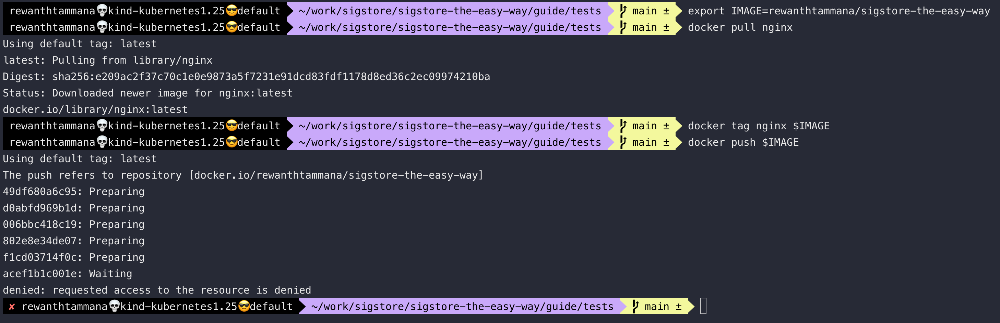
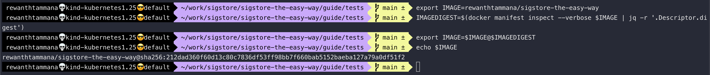

# Set image

Before getting started, let's create an image that we will use throughout this guide. In this case, my dockerhub username is `rewanthtammana`, replace it accordingly.

```bash
# Replace the dockerhub username
export DOCKERHUB_USERNAME=rewanthtammana
export IMAGE=$DOCKERHUB_USERNAME/sigstore-the-easy-way
```

```bash
docker pull nginx
docker tag nginx $IMAGE
docker push $IMAGE
```



It's recommended to use digest values with an image instead of tags like *latest*, *v1*, etc., for signing, verifying, deploying, etc.

```bash
IMAGEDIGEST=$(docker manifest inspect --verbose $IMAGE | jq -r '.Descriptor.digest')
export IMAGE=$IMAGE@$IMAGEDIGEST
echo $IMAGE
```


