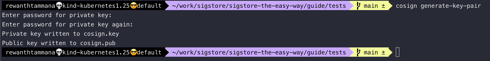
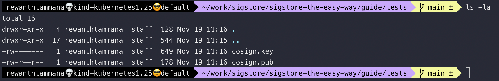
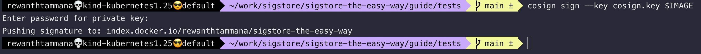
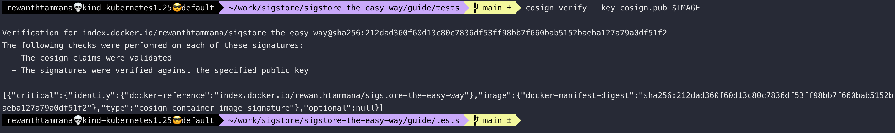

# Sign and verify with key

## Generate key pair

The first step towards signing your software is to generate a key-pair. In the background, cosign uses ECDSA (Elliptic Curve Digital Signature Algorithm) & elliptic.P256 cryptography to generate key-pair, but let's not worry about that & keep things simple.

```bash
cosign generate-key-pair
```



```bash
ls -la
```



## Set image

```bash
# Replace the user, image & tag name accordingly
export IMAGE=rewanthtammana/sigstore-the-easy-way
```

```bash
docker pull nginx
docker tag nginx $IMAGE
docker push $IMAGE
```


### Optional

It's recommended to use digest values with an image instead of tags like *latest*, *v1*, etc., for signing, verifying, deploying, etc.

```bash
IMAGEDIGEST=$(docker manifest inspect --verbose $IMAGE | jq -r '.Descriptor.digest')
export IMAGE=$IMAGE@$IMAGEDIGEST
echo $IMAGE
```


## Sign the artifact

This will sign that thing & push the signature to the OCI registry. For this example, make sure you are logged in to dockerhub from cli.

```bash
cosign sign --key cosign.key $IMAGE
```



## Verify the artifact

```bash
cosign verify --key cosign.pub $IMAGE
```



Observe the list of checks performed above in this method,

```
The following checks were performed on each of these signatures:
  - The cosign claims were validated
  - The signatures were verified against the specified public key
```

There's no involvement of [transparency log](../rekor/readme.md) or [short lived certificates](../fulcio/readme.md) in this method. We will learn about them in the later sections.

