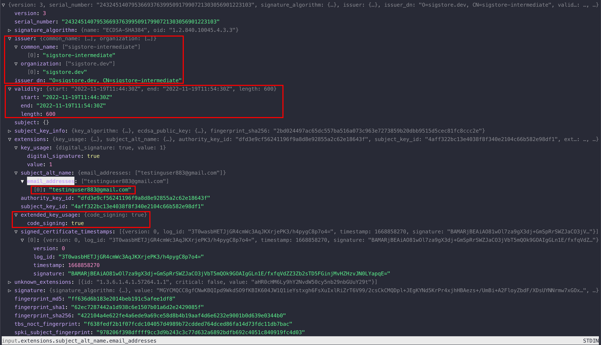
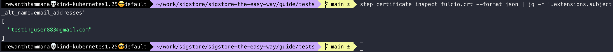

# Analyzing code signing certificates

The experimental feature of cosign allows us to use a keyless signing feature.

Let's extract the output certificate for analysis.

## Set image

We can follow the steps from [this section](../cosign/sign-and-verify-with-key.md#set-image) to set the image. Let's ensure the `IMAGE` variable is set.

```bash
echo $IMAGE
```


## Generate & export certificate

In the [keyless signing section](../cosign/sign-and-verify-without-key.md), we saw it's possible to sign the artifacts/images by logging into the OIDC providers like google/microsoft/github/etc. Let's save the certificate that's being used by cosign for signing for analysis.

```bash
COSIGN_EXPERIMENTAL=1 cosign sign $IMAGE --output-certificate fulcio.crt
ls -lh fulcio.crt
```


## Inspect certificate

We can use the [step](https://smallstep.com/docs/step-cli/installation) tool for analyzing the certificates. The json format of the output makes it easier for parsing & we use [jless](https://github.com/PaulJuliusMartinez/jless) for visualization.

```bash
step certificate inspect fulcio.crt --format json | jless
```



As we can see above, there are lots of helpful information that will allow us to identify the signer & issuer of an artifact.

### Extract certificate validity

In the above screenshot, we can also see the certificate's validity. Sigstore is generating a short-lived certificate with only 10 minutes of validity. The artifact is signed with this short-lived certificate & after 10 minutes, the certificate becomes unusable.

```bash
step certificate inspect fulcio.crt --format json | jq -r '.validity'
```


### Identify signer information

Analyze the certificate to identify the singer's information.

```bash
step certificate inspect fulcio.crt --format json | jq -r '.extensions.subject_alt_name.email_addresses'
```



## Further exploration

The root sigstore signing certificates are usually stored in `~/.sigstore/root` directory. Feel free to explore & inspect the files for a deeper understanding.

```
 ~/.sigstore/root$ tree
.
├── targets
│   ├── artifact.pub
│   ├── ctfe.pub
│   ├── ctfe_2022.pub
│   ├── fulcio.crt.pem
│   ├── fulcio_intermediate_v1.crt.pem
│   ├── fulcio_v1.crt.pem
│   ├── rekor.0.pub
│   └── rekor.pub
└── tuf.db
    ├── 000004.ldb
    ├── 000033.ldb
    ├── 000092.ldb
    ├── 000123.log
    ├── CURRENT
    ├── CURRENT.bak
    ├── LOCK
    ├── LOG
    └── MANIFEST-000124
```
