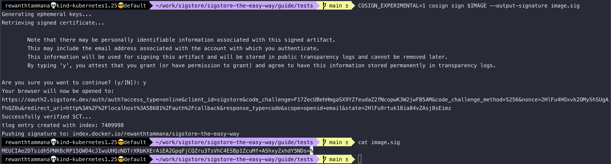
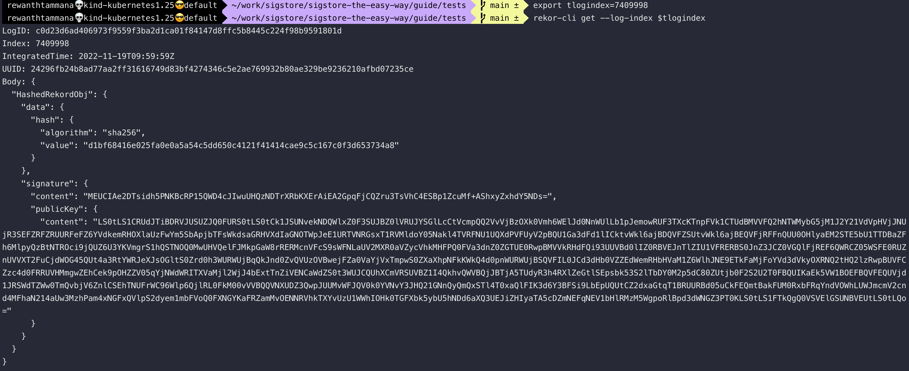

# Compare the signatures uploaded to registry and transparency log

As we discussed in [keyless signing](../cosign/sign-and-verify-without-key.md), the signature is uploaded to the transparency log before pushing to the registry.

To keep this simple, let's save the signature of an artifact (docker image in this case) before uploading it to the registry. We can use the `--output-signature` flag to perform this action.

## Get the tlog entry and signature during the keyless signing

If the image is already signed, we can follow the [download artifact guide](../cosign/download-artifacts.md) to get the signature. Alternatively, we can save the signature to a file before uploading.

```bash
COSIGN_EXPERIMENTAL=1 cosign sign $IMAGE --output-signature image.sig
...
tlog entry created with index: 7409998
...
```

The signature is uploaded to the registry & it's stored in `image.sig` on the local filesystem.

```bash
cat image.sig
MEUCIAe2DTsidh5PNKBcRP15QWD4cJIwuUHQzNDTrXRbKXErAiEA2GpqFjCQZru3TsVhC4ESBp1ZcuMf+AShxyZxhdY5NDs=
```



## Get the signature from the transparency log rekor

Visit [query transparency log](./query-transparency-log.md) section to read more on query rekor.

To validate if the signature is being uploaded to the transparency log during the keyless signing, extract the `tlog index` from the above step. We can use that index to query the public/private rekor instances.

```bash
export tlogindex=7409998
rekor-cli get --log-index $tlogindex
```



We can parse the above output quickly to extract the signature field.

```bash
rekor-cli get --log-index $tlogindex --format json | jq -r '.Body.HashedRekordObj.signature.content'
"MEUCIAe2DTsidh5PNKBcRP15QWD4cJIwuUHQzNDTrXRbKXErAiEA2GpqFjCQZru3TsVhC4ESBp1ZcuMf+AShxyZxhdY5NDs="
```

As we can see above, the values extracted from the transparency log with `rekor-cli` & the signature from the registry are the same. An exact character comparison can be performed, if required, with the below command

```bash
diff <( printf '%s\n' "$(cat image.sig)") <( printf '%s\n' "$(rekor-cli get --log-index $tlogindex --format json | jq -r '.Body.HashedRekordObj.signature.content')")
```

In this way, if required, we can verify the signatures & integrity of the artifacts in both registry & transparency log. To makes things easier, cosign validates it when we run [cosign verify](../cosign/sign-and-verify-without-key.md#verify-the-artifact) command.
