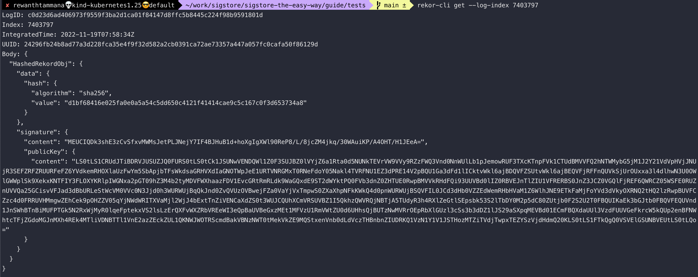
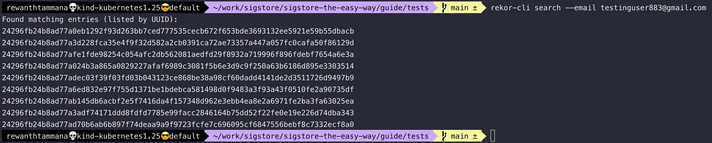
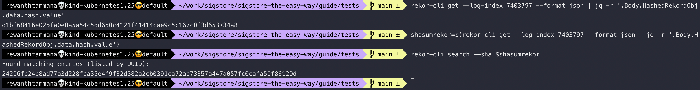

# Query transparency log

This is a short handbook on how to query the transparency log i.e rekor in this case for infomration.

## Set image

We can follow the steps from this [section](./sign-and-verify-with-key.md#set-image), to set image. Just make sure you have $IMAGE set appropriately.

```bash
echo $IMAGE
```


## Rekor-cli with tlog index

In this guide, we discussed about [keyless signing](../cosign/sign-and-verify-without-key.md#sign-the-artifact). After signing the artifact with one of the OIDC providers, we can see a tlog entry in the output.

```bash
COSIGN_EXPERIMENTAL=1 cosign sign $IMAGE
...
tlog entry created with index: 7403797
...
```

We can use the tlog index to query the rekor instance to verify the signature uploaded to rekor.

```bash
rekor-cli get --log-index 7403797
```



## Rekor-cli with email

We can list all the objects signed by a specific person/entity.

```bash
rekor-cli search --email testinguser883@gmail.com
```



We can use the above UUIDs to gather more information on the signatures/artifacts that are uploaded to the transparency log.

## Rekor-cli with shasum of artifact

You can query the transparency log with tlog index or uuid. In the output, you will find the sha256sum of the object. We can even use that value to query the transprency log.

```bash
rekor-cli get --log-index 7403797 --format json | jq -r '.Body.HashedRekordObj.data.hash.value'
```

Once we have the sha value from above, we can use that to search the transparency log for instances of it.

```bash
shasumrekor=$(rekor-cli get --log-index 7403797 --format json | jq -r '.Body.HashedRekordObj.data.hash.value')
rekor-cli search --sha $shasumrekor
```



## Curl request

This is covered in detail as part of [upload artifacts to public rekor](./upload-artifacts-to-public-rekor.md#curl-request) section.

## Rekor-cli with UUID

This is covered in detail as part of [upload artifacts to public rekor](./upload-artifacts-to-public-rekor.md#rekor-cli-with-uuid) section.

## Rekor-cli with artifact

This is covered in detail as part of [upload artifacts to public rekor](./upload-artifacts-to-public-rekor.md#rekor-cli-with-artifact) section.
