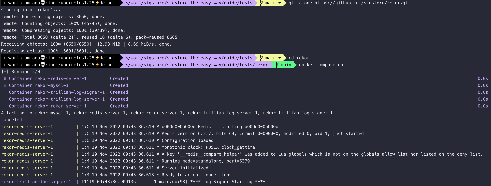

# Upload artifacts to private rekor

In the previous section, we [uploaded artifacts to public rekor](./upload-artifacts-to-public-rekor.md). For some reason, you can't use public rekor instances because you have sensitive information. For this case, it's possible to spin up our own instance of rekor.

```bash
git clone https://github.com/sigstore/rekor.git
cd rekor
docker-compose up
```



The docker-compose has to start multiple services like redis, mysql, trillan signer, trillian server & rekor server. So, it will take a while to spin up. The service exposes port 3000. Be patient.

The same commands from [upload artifacts to public rekor](./upload-artifacts-to-public-rekor.md) can be used with an additional parameter,`--rekor_server` to the rekor-cli.
