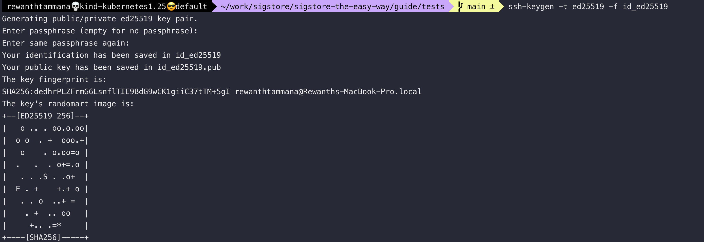
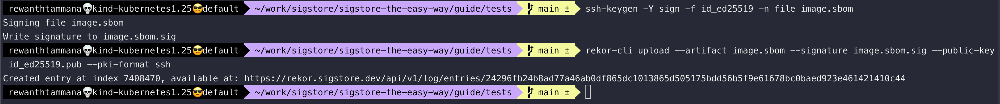
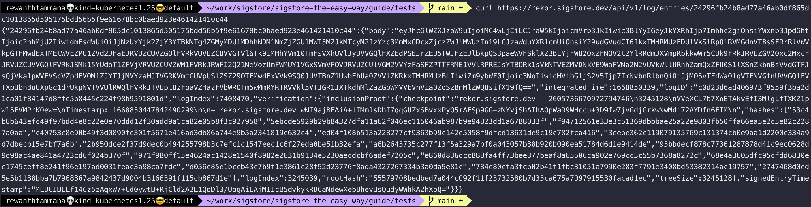
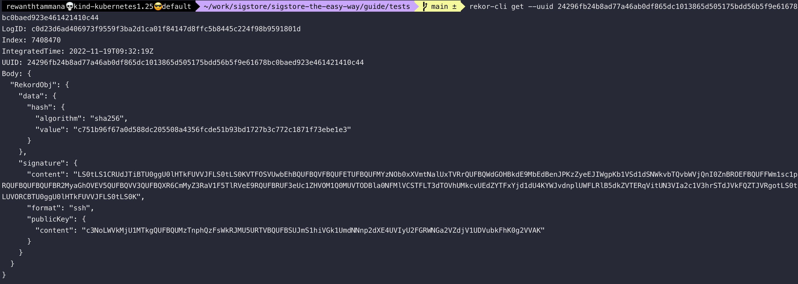
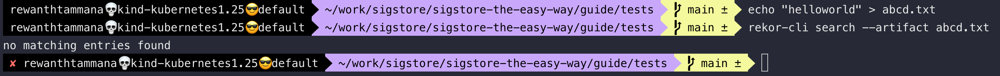
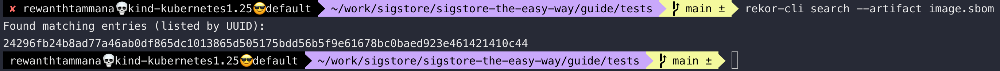

# Upload artifacts to public rekor

Sigstore has a [public rekor instance](https://rekor.sigstore.dev) that is used to upload the artifacts.

In this example, we will [generate an SBOM](../sbom/generate.md), sign & upload it to the public rekor instance for transparency & immutability.

## Sign and upload artifact to rekor

To sign the SBOM, we have to generate cryptographic keys. For this example, let's use the ed25519 algorithm to generate asymmetric keys.

```bash
ssh-keygen -t ed25519 -f id_ed25519
```

The above step prompts for a passphrase, but if you want to pass the value through CLI, the `-N` flag can be used.

```bash
ssh-keygen -t ed25519 -f id_ed25519 -q -N ""
```



If you already have SBOM, it's okay. If not, follow the steps [here](../sbom/generate.md) to generate SBOM.

Once we have the artifact, let's sign it with the ed25519 private key generated above & upload it to the public transparency log.

```bash
ssh-keygen -Y sign -f id_ed25519 -n file image.sbom
rekor-cli upload --artifact image.sbom --signature image.sbom.sig --public-key id_ed25519.pub --pki-format ssh
```



## Query rekor

There are multiple ways to extract the information from rekor. A UUID is returned whenever an object is uploaded to the rekor instance. We can use the UUID to query data.

### Curl request

You can make a curl request to the UUID to gather information about the artifact.

```bash
curl https://rekor.sigstore.dev/api/v1/log/entries/24296fb24b8ad77a46ab0df865dc1013865d505175bdd56b5f9e61678bc0baed923e461421410c44
```



### Rekor-cli with UUID

```bash
rekor-cli get --uuid 24296fb24b8ad77a46ab0df865dc1013865d505175bdd56b5f9e61678bc0baed923e461421410c44
```



### Rekor-cli with artifact

The below command will throw an error because we never uploaded `abcd.txt` to rekor.

```bash
echo "helloworld" > abcd.txt
rekor-cli search --artifact abcd.txt
```



Instead, if we search with the previously uploaded SBOM object, we should get a result.

```bash
rekor-cli search --artifact image.sbom
```



We have the UUID now & it can be used with `rekor-cli get` or `curl` to query the endpoint to gather information about the artifact.

There are many other ways to perform search queries. We will discuss more in the [query transparency log section](./query-transparency-log.md).
