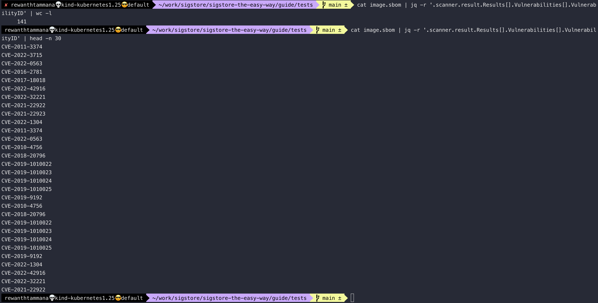

# Generate SBOM

Multiple tools help us to generate SBOMs for docker images, OCI artifacts, SIF images, filesystems, etc.

## Docker

We will use [docker](https://github.com/docker/cli) to generate the SBOM.

```bash
docker sbom $IMAGE > image.sbom
```

Docker CLI uses [syft](https://github.com/anchore/syft) in the background. For extensive usage & customizations, we can download syft.

## Syft

We will use [syft](https://github.com/anchore/syft) to generate the SBOM.

```bash
syft packages $IMAGE > image.sbom
```

## Trivy

We will use [trivy](https://github.com/aquasecurity/trivy) to generate the SBOM.

The `cosign-vuln` format is a custom type created by trivy to store SBOM data along with the list of vulnerabilities & associated CVEs. This is really helpful to review the list of vulnerabilities at the time of packaging & now.

```bash
trivy i --format cosign-vuln $IMAGE > image.sbom
```


We can query the above-generated SBOM to extract information like a list of CVEs, dependencies, etc.

```bash
cat image.sbom | jq -r '.scanner.result.Results[].Vulnerabilities[].VulnerabilityID' | wc -l
```


As you can see above, there are 141 CVEs in your image (i.e., nginx image as we re-tagged it). Let's list the first 30 CVEs from the list.

```bash
cat image.sbom | jq -r '.scanner.result.Results[].Vulnerabilities[].VulnerabilityID' | head -n 30
```


