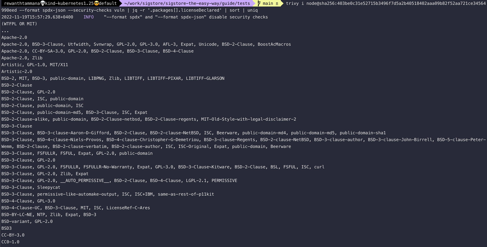

# Use case

Whenever a new concept is introduced, it's common to have a swirling in the head to why you should use it, is it really important, is it worth my time, and so on.

Say, we are building a nodejs application & downloaded the latest nodejs docker image. As most of us know, nodejs downloads hundreds/thousands of dependencies & sub-dependencies.

For example, let's say we want to see the different kind of licenses involved with this nodejs project. SBOMs can be of real help to identify this in one-go. Since, SBOMs contain valuable information about application & components, it's safe to make sure they are tamper proof.

We can write more custom queries depending on the use case. Another use case would be to extract information of dependencies with no license at all. They might be dangerous to use. We can flag or monitor them for malicious updates/supply chain attacks.


## Node image

For this use case, we pick the standard `node` image from dockerhub. We will list only the unique licenses.

```bash
trivy i node@sha256:403be0c31e52715b3496f7d5a2b40518402aaa09b82f52aa721ce34564990eed --format spdx-json --security-checks vuln | jq -r '.packages[].licenseDeclared' | sort | uniq
```



Let's see the different kinds of licenses associated with the node docker image dependencies.

```bash
trivy i node@sha256:403be0c31e52715b3496f7d5a2b40518402aaa09b82f52aa721ce34564990eed --format spdx-json --security-checks vuln | jq -r '.packages[].licenseDeclared' | sort | uniq | wc -l
```

A whooping count of 131 kind of licenses. Just FYI, listing the licenses of various components from standard `node` image. 

```
(WTFPL OR MIT)
...
Apache-2.0
Apache-2.0, BSD-3-Clause, Utfwidth, Svnwrap, GPL-2.0, GPL-3.0, AFL-3, Expat, Unicode, BSD-2-Clause, BoostAcMacros
Apache-2.0, CC-BY-SA-3.0, GPL-2.0, BSD-2-Clause, BSD-3-Clause, BSD-4-Clause
Apache-2.0, Zlib
Artistic, GPL-1.0, MIT/X11
Artistic-2.0
BSD-2, MIT, BSD-3, public-domain, LIBPNG, Zlib, LIBTIFF, LIBTIFF-PIXAR, LIBTIFF-GLARSON
BSD-2-Clause
BSD-2-Clause, GPL-2.0
BSD-2-Clause, ISC, public-domain
BSD-2-Clause, public-domain, ISC
BSD-2-Clause, public-domain-md5, BSD-3-Clause, ISC, Expat
BSD-2-Clause-alike, public-domain, BSD-2-Clause-netbsd, BSD-2-Clause-regents, MIT-Old-Style-with-legal-disclaimer-2
BSD-3-Clause
BSD-3-Clause, BSD-3-clause-Aaron-D-Gifford, BSD-2-Clause, BSD-2-clause-NetBSD, ISC, Beerware, public-domain-md4, public-domain-md5, public-domain-sha1
BSD-3-Clause, BSD-4-clause-Niels-Provos, BSD-4-clause-Christopher-G-Demetriou, BSD-3-clause-Regents, BSD-2-clause-NetBSD, BSD-3-clause-author, BSD-3-clause-John-Birrell, BSD-5-clause-Peter-Wemm, BSD-2-Clause, BSD-2-clause-verbatim, BSD-2-clause-author, ISC, ISC-Original, Expat, public-domain, Beerware
BSD-3-Clause, FSFULLR, FSFUL, Expat, GPL-2.0, public-domain
BSD-3-Clause, GPL-2.0
BSD-3-Clause, GPL-2.0, FSFULLR, FSFULLR-No-Warranty, Expat, GPL-3.0, BSD-3-Clause~Kitware, BSD-2-Clause, BSL, FSFUL, ISC, curl
BSD-3-Clause, GPL-2.0, Zlib, Expat
BSD-3-Clause, GPL-2.0, __AUTO_PERMISSIVE__, BSD-2-Clause, BSD-4-Clause, LGPL-2.1, PERMISSIVE
BSD-3-Clause, Sleepycat
BSD-3-Clause, permissive-like-automake-output, ISC, ISC+IBM, same-as-rest-of-p11kit
BSD-4-Clause, GPL-3.0
BSD-4-Clause-UC, BSD-3-Clause, MIT, ISC, LicenseRef-C-Ares
BSD-BY-LC-NE, NTP, Zlib, Expat, BSD-3
BSD-variant, GPL-2.0
BSD3
CC-BY-3.0
CC0-1.0
Expat
Expat, Apache-2.0
Expat, MIT, all-permissive, GPL-3+ with autoconf exception, BSD-2-Clause, SIL-OFL-1.1, GPL-3.0
Expat, Unicode
Expat, permissive
GPL-1.0, Artistic, Expat, REGCOMP, GPL-2.0-with-bison-exception, Unicode, BZIP, Zlib, GPL-2.0, RRA-KEEP-THIS-NOTICE, BSD-3-clause-with-weird-numbering, CC0-1.0, TEXT-TABS, BSD-4-clause-POWERDOG, BSD-3-clause-GENERIC, BSD-3-Clause, SDBM-PUBLIC-DOMAIN, DONT-CHANGE-THE-GPL, Artistic-dist, LGPL-2.1, Artistic-2, HSIEH-DERIVATIVE, HSIEH-BSD
GPL-2.0
GPL-2.0, All-permissive, configure, installsh
GPL-2.0, BSD-2-Clause, public-domain-s-s-d, public-domain-md5
GPL-2.0, BSD-3-Clause
GPL-2.0, Expat, LGPL-2.1, ISC
GPL-2.0, FTL, MIT, BSD-3-Clause, FSFULLR, FSFAP, Permissive, GPL-3.0, FSFUL, Apache-2.0, OFL-1.1, Public-Domain, Zlib, OpenGroup-BSD-like
GPL-2.0, GPL-2.0-with-autoconf-exception, permissive-fsf, permissive-other
GPL-2.0, GPL-3.0, GFDL-NIV-1.3+, GFDL-1.3, permissive
GPL-2.0, GPL-3.0, LGPL-3.0
GPL-2.0, LGPL-2.0
GPL-2.0, LGPL-2.0, BSD-2-Clause, MIT
GPL-2.0, LGPL-2.0, LGPL-2.1
GPL-2.0, LGPL-2.1
GPL-2.0, LGPL-2.1, EDL-1.0, Expat, GPL-1.0, Artistic-1, GPL-3.0, Artistic, ISC, mingw-runtime, Boost, dlmalloc, Apache-2.0, LGPL-2.0
GPL-2.0, LGPL-2.1, GPL-1.0
GPL-2.0, LGPL-2.1, X11, CRYPTOGAMS, Unicode-data, Xen-interface, BSD-2-Clause
GPL-2.0, Redistribution, use in source, binary forms, with, without, By obtaining, using, and/or copying this software and/or its, Permission to use, copy, modify, distribute this software and, This software is provided 'as-is', without any express, implied, Permission  is  hereby granted, free  of charge, to  any person, Permission is hereby granted, free of charge, to any person obtaining, distribute this software, its, This software is provided as-is, without express, distribute this software for any, * Permission to use this software in any way is granted without
GPL-2.0, X11, LGPL-3.0
GPL-2.0, public-domain
GPL-2.0, public-domain, BSD-3-Clause, LGPL-2.1, BSD-2-Clause, LGPL-2.0, unlimited-free-doc, LGPL-3.0, GPL-2.0-with-bison-exception, GPL-2+-with-bison-exception, SWsoft, Artistic, GPL-3.0, MIT/X11, zlib/libpng
GPL-2.0, public-domain, BSD-4-Clause, MIT, BSD-2-Clause, BSD-3-Clause, LGPL-2.0, LGPL-2.1, GPL-3.0, LGPL-3.0
GPL-3.0
GPL-3.0, FSFUL, LGPL-2.1-or-later
GPL-3.0, GFDL
GPL-3.0, GFDL-1.2
GPL-3.0, GFDL-1.2, GPL-2.0, Artistic, LGPL-2.1, LGPL-3.0
GPL-3.0, GFDL-1.2, GPL-2.0, Artistic, LGPL-3.0
GPL-3.0, GFDL-1.3
GPL-3.0, GFDL-1.3+-no-invariant, FSF-manpages, GFDL-3
GPL-3.0, GPL-2.0
GPL-3.0, GPL-2.0, GFDL-NIV-1.3+
GPL-3.0, GPL-3+ with Autoconf exception, permissive-short-disclaimer, permissive-long-disclaimer, permissive-without-disclaimer, permissive-without-notices-or-disclaimer, GPL-2.0-with-autoconf-exception, GPL-2.0, MIT-X-Consortium, GPL-3+ with Texinfo exception, GFDL-1.3+, GFDL-1.3, no-modification, permissive, other
GPL-3.0, LGPL-3.0
GPL-3.0, LGPL-3.0, GFDL
GPL-3.0, LGPL-3.0, GPL-2.0, Unicode
GPL-3.0, permissive, LGPL-2.1, Expat, BSD-3-Clause, LGPL-3.0, RFC-Reference, TinySCHEME, CC0-1.0
Hylafax
ISC
ImageMagick, aclocal, Makefile-in, Imagemagick, ImageMagickPartlibsquish, ImageMagickPartGraphicsMagick, ImageMagickPartlibjpeg, ImageMagickLicensePartFIG, GPL-2.0, BSD-with-FSF-change-public-domain, ImageMagickLicensePartGsview, ImageMagickLicensePartOpenSSH, Magick++, TatcherUlrichPublicDomain, GPL3+-with-Autoconf-Macros-exception-GNU, GPL3+-with-Autoconf-Macros-exception, GPL2+-with-Autoconf-Macros-exception, GNU-All-Permissive-License, LGPL-3.0, ImageMagickLicensePartEZXML, Perllikelicence, Artistic, GPL-1.0, GPL-3.0
LGPL-2.0
LGPL-2.0, BSD-3-Clause, Expat, Apache-2.0, BSD-2-Clause, 0BSD, Boost-1.0, Unlicense, MPL-2.0, Sun-permissive, Zlib, CC-BY-3.0
LGPL-2.0, Example, TCL, Unicode, ICU, Chromium-BSD-style
LGPL-2.0, GPL-2.0
LGPL-2.1
LGPL-2.1, BSD-3-Clause, g10-permissive, GPL-3.0
LGPL-2.1, BSD-3-Clause, permissive-fsf, permissive-makefile-in, permissive-autoconf-m4-no-warranty, GPL-3+-autoconf-exception, permissive-configure, GPL-2+-autoconf-exception, MIT, GPL-2+-libtool-exception, permissive-autoconf-m4, GPL-2.0, GPL-3.0
LGPL-2.1, CC0-1.0, GPL-2.0, GPL-2 with Linux-syscall-note exception, Expat, public-domain
LGPL-2.1, GAP~FSF, LGPL-3.0, GPL-2+ with libtool exception, GPL-2.0, GPL-3.0, GAP
LGPL-2.1, GPL-2.0
LGPL-2.1, GPL-2.0, GPL-3.0
LGPL-2.1, LGPL-2.0, GPL-2.0
LGPL-2.1, MIT, public-domain, BSD-2-Clause, GPL-2.0
LGPL-2.1, MPL-1.1, GPL-2.0, public-domain, Artistic, GPL-1.0, custom-sil-open-font-license
LGPL-3.0
LGPL-3.0, Expat, GPL-2.0
LGPL-3.0, GPL-2.0
LGPL-3.0, GPL-2.0, FreeSoftware, GPL-2+ with distribution exception, GPL-3.0, GFDL-1.2+, MIT, GFDL-1.2
LGPL-3.0, GPL-2.0, GPL-3.0
LGPL-3.0, GPL-2.0, LGPL-2.0, Expat, GPL-3.0, GPL-3+ with Autoconf exception, public-domain, GAP
LGPL-3.0, GPL-3.0
LGPL-3.0, GPL-3.0, BSD-4-Clause, public-domain-1, public-domain-2, other-1
LGPL-3.0, GPL-3.0, GPLv3
LGPL-3.0, GPL-3.0, MIT, BSD-4-Clause, BSD-3-Clause, BOOST-1.0
LGPL-3.0, LGPL-2.1, GPL-3.0, GFDL-1.3
LicenseRef-C-Ares
LicenseRef-C-Ares, MIT
MIT
MIT, BSD-2-Clause, LGPL-2.1, LGPL-2.0
MIT, Chromium
MIT, GPL-3 (GPL-3 for the fast_float plugin only), GPL-3.0, GPL-2.0
MIT, LicenseRef-C-Ares
MIT, LicenseRef-C-Ares, LicenseRef-uthash
MIT, Python-2.0
MIT, SGI
MIT-1, ISC
MIT/X11, X11, BSD-3-Clause
NONE
OpenSSH, Mazieres-BSD-style, public-domain, BSD-3-Clause, Beer-ware, Powell-BSD-style, Expat-with-advertising-restriction, BSD-2-Clause
OpenSSL
PD, probably-PD, GPL-2.0, LGPL-2.1, permissive-fsf, Autoconf, permissive-nowarranty, none, config-h, LGPL-2.0, noderivs, PD-debian, GPL-3.0
PostgreSQL, Custom-regex, Tcl, Custom-pg_dump, BSD-3-Clause, Custom-Unicode, double-metaphone, GPL-1.0, Artistic, nagaysau-ishii, blf, BSD-2-Clause, imath, rijndael
Python-2.0
The main library is licensed under GNU Lesser, LGPL-3.0, GPL-3.0, GFDL-1.3, CC0 license, Expat, Apache-2.0, LGPLv3+, GPL-2.0, LGPL-2.1, BSD-3-Clause
Unicode-DFS-2016, Unicode-DFS-2015
Zlib
ad-hoc
bitstream-vera, GPL-2.0
curl, ISC, BSD-3-Clause, public-domain, BSD-4-Clause, other
ilmbase, boost
libpng, expat, GPL-2.0, BSD-like-with-advertising-clause, libpng OR Apache-2.0 OR BSD-3-clause, Apache-2.0, BSD-3-Clause
null
openexr, BSD-3-Clause
public-domain, GPL-2.0
```
